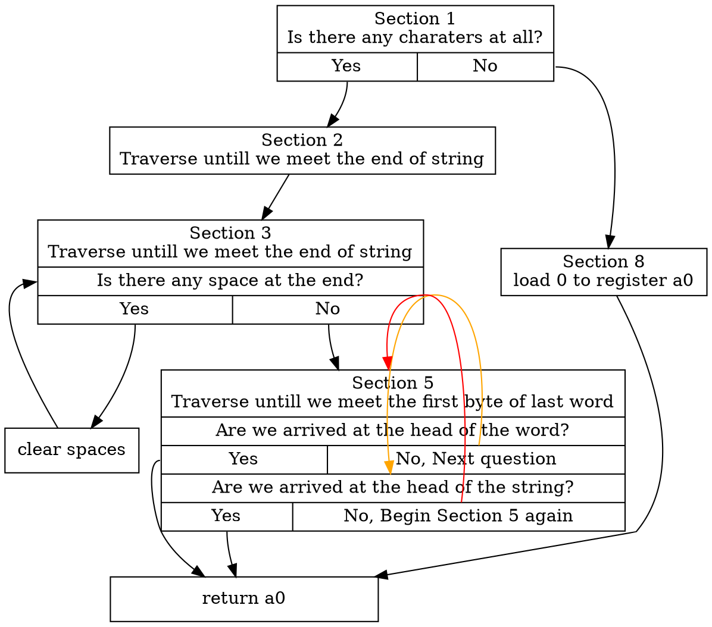

# Development Log
## RISC-V Toolchain
contributed by <[`StevenChou499`](https://github.com/StevenChou499)>

## Question Selection
### Question
[Length of Last Word](https://leetcode.com/problems/length-of-last-word/), which is LeetCode 58 .
### Motivation
The reason I choose this question is because there are two loop using in assembly code, which is a great way for practicing some optimizing skills.

### C code (Modified)
 * Because the original c code uses standard string library and have some errors, I switched to use self-made `strlen` function and modifed the code. Also, I added more test cases for different result in answer.

```c
#include <stdio.h>

int lengthOfLastWord(char *s){
    if (!*s)
        return 0;
    int i = 0;
    char *head = s;
    while (*s) {
        s++;
        i++;
    }
    s = head;
    int length = 0;
    s = s + i - 1;
    
    while(i && *s == ' '){
        s--;
        i--;
    }

    while(i-- && *s != ' '){
        s--;
        length++;
    }

    return length;
}

int main()
{
    char *str1 = "Hello World";
    char *str2 = "I am a student  ";
    char *str3 = "a";
    int len1 = lengthOfLastWord(str1);
    int len2 = lengthOfLastWord(str2);
    int len3 = lengthOfLastWord(str3);
    printf("For string \"%s\", length of last word : %d\n", str1, len1);
    printf("For string \"%s\", length of last word : %d\n", str2, len2);
    printf("For string \"%s\", length of last word : %d\n", str3, len3);

    return 0;
}
```

 * Running result : 
```bash
$ riscv-none-elf-gcc -march=rv32i -mabi=ilp32 -o lengthoflastword.elf lengthoflastword.c
$ ../rv32emu/build/rv32emu lengthoflastword.elf
For string "Hello World", length of last word : 5
For string "I am a student  ", length of last word : 7
For string "a", length of last word : 1
inferior exit code 0
```

### Assembly code (Modified)
 * Same as the C code, I added some modification in order to have all three test cases and same output as the C code and also obey the calling convention.

```asm
.org 0
# Provide program starting address to linker
.global _start

/* newlib system calls */
.set SYSEXIT,  93
.set SYSWRITE, 64

.data
str1:       .string "Hello World"
            .set str1len, .-str1
str2:       .string "I am a student  "  
            .set str2len, .-str2
str3:       .string "a"
            .set str3len, .-str3
fstr:       .string "For string \""
            .set flen, .-fstr
answrstr:   .string "\", length of last word : "
            .set answrlen, .-answrstr  
newline:    .string "\n"
            .set nllen, .-newline

.text
_start:
        # function : lengthOfLastWord(char * s)
        # a0 : pointer to the start of the string
        la          a0, str1
        # find the position of the last letter is not space
        jal         ra, lengthoflastword        # call strlen()
        add         a2, x0, a0
        la          a0, str1
        li          a1, str1len
        jal         print_result

        la          a0, str2
        # find the position of the last letter is not space
        jal         ra, lengthoflastword        # call strlen()
        add         a2, x0, a0
        la          a0, str2
        li          a1, str2len
        jal         print_result

        la          a0, str3
        # find the position of the last letter is not space
        jal         ra, lengthoflastword        # call strlen()
        add         a2, x0, a0
        la          a0, str3
        li          a1, str3len
        jal         print_result

        li          a0, 0             # return value is 0
        li          a7, SYSEXIT       # end
        ecall

nochar:
        li          a0, 0
        ret
lengthoflastword:
        lb          t0, 0(a0)
        beq         t0, x0, nochar
        addi        a1, x0, 1         # there are at least one character
findend:
        # a0 : moving pointer untill we reach the end of the string
        # a1 : counting the number of characters
        addi        a0, a0, 1         # find the last position of the string
        addi        a1, a1, 1
        lb          t0, 0(a0)
        bne         t0, x0, findend
        li          a2, 32            # store space to register a3
loop1:
        # now we reach the end of the string
        beq         a1, x0, return    # if encounter the last position, return
        addi        a0, a0, -1        # s--
        addi        a1, a1, -1        # the last position is not space
        lb          t0, 0(a0)         # t0 = s[i]
        beq         t0, a2, loop1     # while(char[i] == " ")
        add         a3, x0, a0        # a3 = a0
        add         a0, x0, x0
loop2:
        beq         a1, x0, return    # if encounter the last position, return
        addi        a1, a1, -1
        addi        a3, a3, -1
        addi        a0, a0, 1         # s++
        lb          t0, 0(a3)         # t0 = s[i]
        bne         t0, a2, loop2     
return:
        ret

print_result:
        add         s0, x0, a0
        add         s1, x0, a1
        add         s2, x0, a2
        li          a7, SYSWRITE
        li          a0, 1             # print For string : "
        la          a1, fstr
        la          a2, flen
        ecall

        li          a7, SYSWRITE
        li          a0, 1             # print i am a student  
        add         a1, x0, s0
        add         a2, x0, s1
        ecall

        li          a7, SYSWRITE
        li          a0, 1             # print ", length of last word is   
        la          a1, answrstr
        li          a2, answrlen
        ecall

        li          a7, SYSWRITE
        addi        a1, s2, 48        # get length
        addi        sp, sp, -4
        sw          a1, 0(sp)         # store answer in stack
        li          a0, 1             # print answer
        addi        a1, sp, 0
        li          a2, 4
        ecall
        addi        sp, sp, 4

        li          a7, SYSWRITE
        li          a0, 1             # print new line
        la          a1, newline       
        li          a2, nllen
        ecall
        ret
```

 * Running result : 
```bash
$ make
riscv-none-elf-as -R -march=rv32i -mabi=ilp32 -o lengthoflastword.o lengthoflastword.S
riscv-none-elf-ld -o lengthoflastword.elf -T lengthoflastword.ld --oformat=elf32-littleriscv lengthoflastword.o
$ ../rv32emu/build/rv32emu lengthoflastword.elf
For string : "Hello World", length of last word is 5
For string : "I  am a student  ", length of last word is 7
For string : "a", length of last word is 1
inferior exit code 0
```

### Disassembly the `.elf` files

 * After compiling the C code to `lengthoflastwordO1.elf` , we can now disassembly the assembly code generated by the compiler. First we will take a look at the `-O1` optimization result, also we will add some comment and some empty line for better understanding : 

```asm
000100c4 <_start>:
    ...
   100ec:	285d                	jal	101a2 <main>  # call main func.
   100ee:	b75d                	j	10094 <exit>
000100dc <_start>:
    ...

00010140 <lengthOfLastWord>:

   # ------------------------------ Section 1 ---------------------------------
   # This section checks if there is any characters at all
   10140:	00054783          	lbu	a5,0(a0)
   10144:	cfa9                	beqz	a5,1019e <lengthOfLastWord+0x5e>

   # ------------------------------ Section 2 ---------------------------------
   # This section traverse the pointer to the end of string
   10146:	4781                	li	a5,0
   10148:	86be                	mv	a3,a5
   1014a:	0785                	addi	a5,a5,1
   1014c:	00f50733          	add	a4,a0,a5
   10150:	00074703          	lbu	a4,0(a4)
   10154:	fb75                	bnez	a4,10148 <lengthOfLastWord+0x8>
   
   # ------------------------------ Section 3 ---------------------------------
   # This section finds the last character of the last word
   10156:	00d50733          	add	a4,a0,a3
   1015a:	02000613          	li	a2,32
   1015e:	cb91                	beqz	a5,10172 <lengthOfLastWord+0x32>
   10160:	00074683          	lbu	a3,0(a4)
   10164:	00c69963          	bne	a3,a2,10176 <lengthOfLastWord+0x36>
   10168:	177d                	addi	a4,a4,-1
   1016a:	17fd                	addi	a5,a5,-1
   1016c:	fbf5                	bnez	a5,10160 <lengthOfLastWord+0x20>
    
   # ------------------------------ Section 4 ---------------------------------
   # This section of code won't be executed 
   1016e:	853e                	mv	a0,a5
   10170:	8082                	ret
   10172:	853e                	mv	a0,a5
   10174:	8082                	ret
   
   # ------------------------------ Section 5 ---------------------------------
   # This section counts the number of characters of the last word
   10176:	86ba                	mv	a3,a4
   10178:	4501                	li	a0,0
   1017a:	02000613          	li	a2,32
   1017e:	40e78733          	sub	a4,a5,a4
   10182:	cb99                	beqz	a5,10198 <lengthOfLastWord+0x58>
   10184:	0006c783          	lbu	a5,0(a3)
   10188:	00c78a63          	beq	a5,a2,1019c <lengthOfLastWord+0x5c>
   1018c:	16fd                	addi	a3,a3,-1
   1018e:	0505                	addi	a0,a0,1
   10190:	00e687b3          	add	a5,a3,a4
   10194:	fbe5                	bnez	a5,10184 <lengthOfLastWord+0x44>
   
   # ------------------------------ Section 6 ---------------------------------
   # This section of code won't be executed
   10196:	a029                	j	101a0 <lengthOfLastWord+0x60>
   10198:	853e                	mv	a0,a5
   1019a:	8082                	ret
   
   # ------------------------------ Section 7 ---------------------------------
   # We will get to this section when we met the space in front of the last word
   1019c:	8082                	ret
   
   # ------------------------------ Section 8 ---------------------------------
   # We will get to this section when there are no characters at all
   1019e:	4501                	li	a0,0
   
   # ------------------------------ Section 9 ---------------------------------
   # We will get to this section when we run out of characters
   101a0:	8082                	ret
    ...

000101a2 <main>:
   101a2:	1101                	addi	sp,sp,-32  # opening the stack
   101a4:	ce06                	sw	ra,28(sp)  # pushing ret value
   101a6:	cc22                	sw	s0,24(sp)  # calling convention
   101a8:	ca26                	sw	s1,20(sp)
   101aa:	c84a                	sw	s2,16(sp)
   101ac:	c64e                	sw	s3,12(sp)
   101ae:	c452                	sw	s4,8(sp)
   101b0:	c256                	sw	s5,4(sp)
   
   # storing address of "Hello World" in a0 and call lengthofLastWord
   101b2:	6af1                	lui	s5,0x1c
   101b4:	8f8a8513          	addi	a0,s5,-1800 # 1b8f8 <__clzsi2+0x70>
   101b8:	3761                	jal	10140 <lengthOfLastWord>
   101ba:	842a                	mv	s0,a0      # save ret value in s0
   
   # storing address of "I am a student  " in a0 and call lengthofLastWord
   101bc:	6a71                	lui	s4,0x1c
   101be:	904a0513          	addi	a0,s4,-1788 # 1b904 <__clzsi2+0x7c>
   101c2:	3fbd                	jal	10140 <lengthOfLastWord>
   101c4:	892a                	mv	s2,a0      # save ret value in s2
   
   # storing address of "a" in a0 and call lengthofLastWord
   101c6:	69f1                	lui	s3,0x1c
   101c8:	91898513          	addi	a0,s3,-1768 # 1b918 <__clzsi2+0x90>
   101cc:	3f95                	jal	10140 <lengthOfLastWord>
   101ce:	84aa                	mv	s1,a0      # save ret value in s1
   
   101d0:	8622                	mv	a2,s0
   101d2:	8f8a8593          	addi	a1,s5,-1800
   101d6:	6471                	lui	s0,0x1c
   101d8:	91c40513          	addi	a0,s0,-1764 # 1b91c <__clzsi2+0x94>
   101dc:	2255                	jal	10380 <printf>
   101de:	864a                	mv	a2,s2
   101e0:	904a0593          	addi	a1,s4,-1788
   101e4:	91c40513          	addi	a0,s0,-1764
   101e8:	2a61                	jal	10380 <printf>
   101ea:	8626                	mv	a2,s1
   101ec:	91898593          	addi	a1,s3,-1768
   101f0:	91c40513          	addi	a0,s0,-1764
   101f4:	2271                	jal	10380 <printf>
   101f6:	4501                	li	a0,0
   101f8:	40f2                	lw	ra,28(sp)  # poping out ret value
   101fa:	4462                	lw	s0,24(sp)  # calling convention
   101fc:	44d2                	lw	s1,20(sp)
   101fe:	4942                	lw	s2,16(sp)
   10200:	49b2                	lw	s3,12(sp)
   10202:	4a22                	lw	s4,8(sp)
   10204:	4a92                	lw	s5,4(sp)
   10206:	6105                	addi	sp,sp,32  # closing the stack
   10208:	8082                	ret
    ...
```
 * Below is the basic control flow graph : 


 * Below is the disassembly size : 
```bash
$ riscv-none-elf-size lengthoflastwordO1.elf
   text	   data	    bss	    dec	    hex	filename
  50770	   2640	    812	  54222	   d3ce	lengthoflastwordO1.elf
```

 * Next I will disassemble my compiled hand-written assembly code : 

```asm
    ...
00000000 <_start>:
   0:	00000517          	auipc	a0,0x0
   4:	15c50513          	addi	a0,a0,348 # 15c <str1>
   8:	06c000ef          	jal	ra,74 <lengthoflastword>
   c:	00a00633          	add	a2,zero,a0
  10:	00000517          	auipc	a0,0x0
  14:	14c50513          	addi	a0,a0,332 # 15c <str1>
  18:	00c00593          	li	a1,12
  1c:	0b0000ef          	jal	ra,cc <print_result>
  20:	00000517          	auipc	a0,0x0
  24:	14850513          	addi	a0,a0,328 # 168 <str2>
  28:	04c000ef          	jal	ra,74 <lengthoflastword>
  2c:	00a00633          	add	a2,zero,a0
  30:	00000517          	auipc	a0,0x0
  34:	13850513          	addi	a0,a0,312 # 168 <str2>
  38:	01100593          	li	a1,17
  3c:	090000ef          	jal	ra,cc <print_result>
  40:	00000517          	auipc	a0,0x0
  44:	13950513          	addi	a0,a0,313 # 179 <str3>
  48:	02c000ef          	jal	ra,74 <lengthoflastword>
  4c:	00a00633          	add	a2,zero,a0
  50:	00000517          	auipc	a0,0x0
  54:	12950513          	addi	a0,a0,297 # 179 <str3>
  58:	00200593          	li	a1,2
  5c:	070000ef          	jal	ra,cc <print_result>
  60:	00000513          	li	a0,0
  64:	05d00893          	li	a7,93
  68:	00000073          	ecall

0000006c <nochar>:
  6c:	00000513          	li	a0,0
  70:	00008067          	ret

00000074 <lengthoflastword>:
  74:	00050283          	lb	t0,0(a0)
  78:	fe028ae3          	beqz	t0,6c <nochar>
  7c:	00100593          	li	a1,1

00000080 <findend>:
  80:	00150513          	addi	a0,a0,1
  84:	00158593          	addi	a1,a1,1
  88:	00050283          	lb	t0,0(a0)
  8c:	fe029ae3          	bnez	t0,80 <findend>
  90:	02000613          	li	a2,32

00000094 <loop1>:
  94:	02058a63          	beqz	a1,c8 <return>
  98:	fff50513          	addi	a0,a0,-1
  9c:	fff58593          	addi	a1,a1,-1
  a0:	00050283          	lb	t0,0(a0)
  a4:	fec288e3          	beq	t0,a2,94 <loop1>
  a8:	00a006b3          	add	a3,zero,a0
  ac:	00000533          	add	a0,zero,zero

000000b0 <loop2>:
  b0:	00058c63          	beqz	a1,c8 <return>
  b4:	fff58593          	addi	a1,a1,-1
  b8:	fff68693          	addi	a3,a3,-1
  bc:	00150513          	addi	a0,a0,1
  c0:	00068283          	lb	t0,0(a3)
  c4:	fec296e3          	bne	t0,a2,b0 <loop2>

000000c8 <return>:
  c8:	00008067          	ret

000000cc <print_result>:
  cc:	00a00433          	add	s0,zero,a0
  d0:	00b004b3          	add	s1,zero,a1
  d4:	00c00933          	add	s2,zero,a2
  d8:	04000893          	li	a7,64
  dc:	00100513          	li	a0,1
  e0:	00000597          	auipc	a1,0x0
  e4:	09b58593          	addi	a1,a1,155 # 17b <fstr>
  e8:	00d00613          	li	a2,13
  ec:	00000073          	ecall
  f0:	04000893          	li	a7,64
  f4:	00100513          	li	a0,1
  f8:	008005b3          	add	a1,zero,s0
  fc:	00900633          	add	a2,zero,s1
 100:	00000073          	ecall
 104:	04000893          	li	a7,64
 108:	00100513          	li	a0,1
 10c:	00000597          	auipc	a1,0x0
 110:	07c58593          	addi	a1,a1,124 # 188 <answrstr>
 114:	01a00613          	li	a2,26
 118:	00000073          	ecall
 11c:	04000893          	li	a7,64
 120:	03090593          	addi	a1,s2,48
 124:	ffc10113          	addi	sp,sp,-4
 128:	00b12023          	sw	a1,0(sp)
 12c:	00100513          	li	a0,1
 130:	00010593          	mv	a1,sp
 134:	00400613          	li	a2,4
 138:	00000073          	ecall
 13c:	00410113          	addi	sp,sp,4
 140:	04000893          	li	a7,64
 144:	00100513          	li	a0,1
 148:	00000597          	auipc	a1,0x0
 14c:	05a58593          	addi	a1,a1,90 # 1a2 <newline>
 150:	00200613          	li	a2,2
 154:	00000073          	ecall
 158:	00008067          	ret

0000015c <str1>:
 15c:	6548                	.2byte	0x6548
 15e:	6c6c                	.2byte	0x6c6c
 160:	6f57206f          	j	73054 <newline+0x72eb2>
 164:	6c72                	.2byte	0x6c72
 166:	0064                	.2byte	0x64

00000168 <str2>:
 168:	2049                	.2byte	0x2049
 16a:	6d61                	.2byte	0x6d61
 16c:	6120                	.2byte	0x6120
 16e:	7320                	.2byte	0x7320
 170:	7574                	.2byte	0x7574
 172:	6564                	.2byte	0x6564
 174:	746e                	.2byte	0x746e
 176:	2020                	.2byte	0x2020
	...

00000179 <str3>:
 179:	0061                	.2byte	0x61

0000017b <fstr>:
 17b:	6f46                	.2byte	0x6f46
 17d:	2072                	.2byte	0x2072
 17f:	69727473          	.4byte	0x69727473
 183:	676e                	.2byte	0x676e
 185:	2220                	.2byte	0x2220
	...

00000188 <answrstr>:
 188:	2c22                	.2byte	0x2c22
 18a:	6c20                	.2byte	0x6c20
 18c:	6e65                	.2byte	0x6e65
 18e:	20687467          	.4byte	0x20687467
 192:	6c20666f          	jal	a2,6854 <newline+0x66b2>
 196:	7361                	.2byte	0x7361
 198:	2074                	.2byte	0x2074
 19a:	64726f77          	.4byte	0x64726f77
 19e:	3a20                	.2byte	0x3a20
 1a0:	0020                	.2byte	0x20

000001a2 <newline>:
 1a2:	000a                	.2byte	0xa
    ...
```
 * Below is the disassembly size : 
```bash
$ riscv-none-elf-size lengthoflastword.elf
   text	   data	    bss	    dec	    hex	filename
    420	      0	      0	    420	    1a4	lengthoflastword_op0.elf
```

After disassembling both the compiled C code and hand-written assembly, I find out that compiler tends to use more branches for detection and avoid using `t` registers. For example, when detect whether the end of the string has any space characters, the compiler will first check the last byte of the character. If the last character is space, then we will execute the next line, which is the function of eliminating all the spaces (uses another branch for detecting space character). If not, then we will just jump to another address to handle the rest function.

Also, I find out that the compiler uses different registers for space comparisons. Unlike my hand-written code which just uses register `a2` to store the space character and uses it untill function return; in the execution of compiler code, it repeatly uses register `a3` and `a4` to store the space character and uses the other register to load the bytes for comparison.

### Optimization level difference

Because calling `printf()` inside the program will significantly increase the code size and also influence the execution speed. So in order to get a better comparisons with each optimization level, we will first comment the `printf()` function.

:::info
After taking a look at the disassembly code. I found out that all the optimization level except `-O0` level (which is no optimization) will just ignore the call of function `lengthoflastword()` , so we ultimately have include the `printf()` function in order to force the compiler to call the function.
:::

#### `-O0` level
First we will take a look at `-O0` level, which is no optimization.
 * Disassembled code : 
```asm
00010140 <lengthOfLastWord>:
   10140:	7179                	addi	sp,sp,-48
   10142:	d622                	sw	s0,44(sp)
   10144:	1800                	addi	s0,sp,48
   10146:	fca42e23          	sw	a0,-36(s0)
   1014a:	fdc42783          	lw	a5,-36(s0)
   1014e:	0007c783          	lbu	a5,0(a5)
   10152:	e399                	bnez	a5,10158 <lengthOfLastWord+0x18>
   10154:	4781                	li	a5,0
   10156:	a07d                	j	10204 <lengthOfLastWord+0xc4>
   10158:	fe042623          	sw	zero,-20(s0)
   1015c:	fdc42783          	lw	a5,-36(s0)
   10160:	fef42223          	sw	a5,-28(s0)
   10164:	a819                	j	1017a <lengthOfLastWord+0x3a>
   10166:	fdc42783          	lw	a5,-36(s0)
   1016a:	0785                	addi	a5,a5,1
   1016c:	fcf42e23          	sw	a5,-36(s0)
   10170:	fec42783          	lw	a5,-20(s0)
   10174:	0785                	addi	a5,a5,1
   10176:	fef42623          	sw	a5,-20(s0)
   1017a:	fdc42783          	lw	a5,-36(s0)
   1017e:	0007c783          	lbu	a5,0(a5)
   10182:	f3f5                	bnez	a5,10166 <lengthOfLastWord+0x26>
   10184:	fe442783          	lw	a5,-28(s0)
   10188:	fcf42e23          	sw	a5,-36(s0)
   1018c:	fe042423          	sw	zero,-24(s0)
   10190:	fec42783          	lw	a5,-20(s0)
   10194:	17fd                	addi	a5,a5,-1
   10196:	fdc42703          	lw	a4,-36(s0)
   1019a:	97ba                	add	a5,a5,a4
   1019c:	fcf42e23          	sw	a5,-36(s0)
   101a0:	a819                	j	101b6 <lengthOfLastWord+0x76>
   101a2:	fdc42783          	lw	a5,-36(s0)
   101a6:	17fd                	addi	a5,a5,-1
   101a8:	fcf42e23          	sw	a5,-36(s0)
   101ac:	fec42783          	lw	a5,-20(s0)
   101b0:	17fd                	addi	a5,a5,-1
   101b2:	fef42623          	sw	a5,-20(s0)
   101b6:	fec42783          	lw	a5,-20(s0)
   101ba:	c785                	beqz	a5,101e2 <lengthOfLastWord+0xa2>
   101bc:	fdc42783          	lw	a5,-36(s0)
   101c0:	0007c703          	lbu	a4,0(a5)
   101c4:	02000793          	li	a5,32
   101c8:	fcf70de3          	beq	a4,a5,101a2 <lengthOfLastWord+0x62>
   101cc:	a819                	j	101e2 <lengthOfLastWord+0xa2>
   101ce:	fdc42783          	lw	a5,-36(s0)
   101d2:	17fd                	addi	a5,a5,-1
   101d4:	fcf42e23          	sw	a5,-36(s0)
   101d8:	fe842783          	lw	a5,-24(s0)
   101dc:	0785                	addi	a5,a5,1
   101de:	fef42423          	sw	a5,-24(s0)
   101e2:	fec42783          	lw	a5,-20(s0)
   101e6:	fff78713          	addi	a4,a5,-1
   101ea:	fee42623          	sw	a4,-20(s0)
   101ee:	cb89                	beqz	a5,10200 <lengthOfLastWord+0xc0>
   101f0:	fdc42783          	lw	a5,-36(s0)
   101f4:	0007c703          	lbu	a4,0(a5)
   101f8:	02000793          	li	a5,32
   101fc:	fcf719e3          	bne	a4,a5,101ce <lengthOfLastWord+0x8e>
   10200:	fe842783          	lw	a5,-24(s0)
   10204:	853e                	mv	a0,a5
   10206:	5432                	lw	s0,44(sp)
   10208:	6145                	addi	sp,sp,48
   1020a:	8082                	ret
```
 * Usage of register and stack : 
     * stack usage : 48 bytes
     * register usage
         * a register : 3
         * s register : 1
         * t register : 0
         * total register : 4
     * load/store instructions : 36
     * branching instructions : 6
     * jumping instructions (exclude `ret`) : 4

 * Code size : 
```bash
$ riscv-none-elf-gcc -march=rv32i -mabi=ilp32 -O0 -o lengthoflastwordO0.elf lengthoflastword.c
$ riscv-none-elf-size lengthoflastwordO0.elf
   text	   data	    bss	    dec	    hex	filename
  50900	   2640	    812	  54352	   d450	lengthoflastwordO0.elf
```
We can see that after we eliminate the `printf()` function, we significantly decrease our code size.

 * Execution speed : 
```bash
$ ../rv32emu/build/rv32emu --stats lengthoflastwordO0.elf
inferior exit code 0
For string "Hello World", length of last word : 5
For string "I am a student  ", length of last word : 7
For string "a", length of last word : 1
inferior exit code 0
CSR cycle count: 6898
```

#### `-O1` level
Next is `-O1` level, which is first level optimization.
 * Diassembly : 
```asm
00010140 <lengthOfLastWord>:
   10140:	00054783          	lbu	a5,0(a0)
   10144:	cfa9                	beqz	a5,1019e <lengthOfLastWord+0x5e>
   10146:	4781                	li	a5,0
   10148:	86be                	mv	a3,a5
   1014a:	0785                	addi	a5,a5,1
   1014c:	00f50733          	add	a4,a0,a5
   10150:	00074703          	lbu	a4,0(a4)
   10154:	fb75                	bnez	a4,10148 <lengthOfLastWord+0x8>
   10156:	00d50733          	add	a4,a0,a3
   1015a:	02000613          	li	a2,32
   1015e:	cb91                	beqz	a5,10172 <lengthOfLastWord+0x32>
   10160:	00074683          	lbu	a3,0(a4)
   10164:	00c69963          	bne	a3,a2,10176 <lengthOfLastWord+0x36>
   10168:	177d                	addi	a4,a4,-1
   1016a:	17fd                	addi	a5,a5,-1
   1016c:	fbf5                	bnez	a5,10160 <lengthOfLastWord+0x20>
   1016e:	853e                	mv	a0,a5
   10170:	8082                	ret
   10172:	853e                	mv	a0,a5
   10174:	8082                	ret
   10176:	86ba                	mv	a3,a4
   10178:	4501                	li	a0,0
   1017a:	02000613          	li	a2,32
   1017e:	40e78733          	sub	a4,a5,a4
   10182:	cb99                	beqz	a5,10198 <lengthOfLastWord+0x58>
   10184:	0006c783          	lbu	a5,0(a3)
   10188:	00c78a63          	beq	a5,a2,1019c <lengthOfLastWord+0x5c>
   1018c:	16fd                	addi	a3,a3,-1
   1018e:	0505                	addi	a0,a0,1
   10190:	00e687b3          	add	a5,a3,a4
   10194:	fbe5                	bnez	a5,10184 <lengthOfLastWord+0x44>
   10196:	a029                	j	101a0 <lengthOfLastWord+0x60>
   10198:	853e                	mv	a0,a5
   1019a:	8082                	ret
   1019c:	8082                	ret
   1019e:	4501                	li	a0,0
   101a0:	8082                	ret
```
 * Usage of register and stack : 
     * stack usage : 0 bytes
     * register usage
         * a register : 5
         * s register : 0
         * t register : 0
         * total register : 5
     * load/store instructions : 4
     * branching instructions : 8
     * jumping instructions (exclude `ret`) : 1

 * Code size : 
```bash
$ riscv-none-elf-gcc -march=rv32i -mabi=ilp32 -O1 -o lengthoflastwordO1.elf lengthoflastword.c
$ riscv-none-elf-size lengthoflastwordO1.elf
   text	   data	    bss	    dec	    hex	filename
  50770	   2640	    812	  54222	   d3ce	lengthoflastwordO1.elf
```
We can see that the `text` size has reduced 100 bytes, but the other portion doesn't change.

 * Execution speed : 
```bash
$ ../rv32emu/build/rv32emu --stats lengthoflastwordO1.elf
For string "Hello World", length of last word : 5
For string "I am a student  ", length of last word : 7
For string "a", length of last word : 1
inferior exit code 0
CSR cycle count: 6601
```
The total cycle decrease almost 300 cycles, which is a large portion of execution cycle.

#### `-O2` level
Next is `-O2` level, which is second level optimization.
 * Disassembly : 
```asm
000101ac <lengthOfLastWord.part.0>:
   101ac:	00054703          	lbu	a4,0(a0)
   101b0:	87aa                	mv	a5,a0
   101b2:	4501                	li	a0,0
   101b4:	c339                	beqz	a4,101fa <lengthOfLastWord.part.0+0x4e>
   101b6:	86aa                	mv	a3,a0
   101b8:	0505                	addi	a0,a0,1
   101ba:	00a78733          	add	a4,a5,a0
   101be:	00074703          	lbu	a4,0(a4)
   101c2:	fb75                	bnez	a4,101b6 <lengthOfLastWord.part.0+0xa>
   101c4:	97b6                	add	a5,a5,a3
   101c6:	02000613          	li	a2,32
   101ca:	a019                	j	101d0 <lengthOfLastWord.part.0+0x24>
   101cc:	17fd                	addi	a5,a5,-1
   101ce:	c515                	beqz	a0,101fa <lengthOfLastWord.part.0+0x4e>
   101d0:	0007c683          	lbu	a3,0(a5)
   101d4:	872a                	mv	a4,a0
   101d6:	157d                	addi	a0,a0,-1
   101d8:	fec68ae3          	beq	a3,a2,101cc <lengthOfLastWord.part.0+0x20>
   101dc:	4501                	li	a0,0
   101de:	02000593          	li	a1,32
   101e2:	8f1d                	sub	a4,a4,a5
   101e4:	a019                	j	101ea <lengthOfLastWord.part.0+0x3e>
   101e6:	0505                	addi	a0,a0,1
   101e8:	ca09                	beqz	a2,101fa <lengthOfLastWord.part.0+0x4e>
   101ea:	0007c683          	lbu	a3,0(a5)
   101ee:	17fd                	addi	a5,a5,-1
   101f0:	00e78633          	add	a2,a5,a4
   101f4:	feb699e3          	bne	a3,a1,101e6 <lengthOfLastWord.part.0+0x3a>
   101f8:	8082                	ret
   101fa:	8082                	ret
```
 * Usage of register and stack : 
     * stack usage : 0 bytes
     * register usage
         * a register : 6
         * s register : 0
         * t register : 0
         * total register : 6
     * load/store instructions : 4
     * branching instructions : 6
     * jumping instructions (exclude `ret`) : 2

 * Code size : 
```bash
$ riscv-none-elf-gcc -march=rv32i -mabi=ilp32 -O2 -o lengthoflastwordO2.elf lengthoflastword.c
$ riscv-none-elf-size lengthoflastwordO2.elf
   text	   data	    bss	    dec	    hex	filename
  50770	   2640	    812	  54222	   d3ce	lengthoflastwordO2.elf
```
We can see that now the `text` size has increases.

 * Execution speed : 
```bash
$ ../rv32emu/build/rv32emu --stats lengthoflastwordO2.elf
For string "Hello World", length of last word : 5
For string "I am a student  ", length of last word : 7
For string "a", length of last word : 1
inferior exit code 0
CSR cycle count: 6615
```

#### `-O3` level
Next is `-O3` level, which is the most aggresive optimization.
 * Disassembly : 
```asm
000101ac <lengthOfLastWord.part.0>:
   101ac:	00054703          	lbu	a4,0(a0)
   101b0:	87aa                	mv	a5,a0
   101b2:	4501                	li	a0,0
   101b4:	c339                	beqz	a4,101fa <lengthOfLastWord.part.0+0x4e>
   101b6:	86aa                	mv	a3,a0
   101b8:	0505                	addi	a0,a0,1
   101ba:	00a78733          	add	a4,a5,a0
   101be:	00074703          	lbu	a4,0(a4)
   101c2:	fb75                	bnez	a4,101b6 <lengthOfLastWord.part.0+0xa>
   101c4:	97b6                	add	a5,a5,a3
   101c6:	02000613          	li	a2,32
   101ca:	a019                	j	101d0 <lengthOfLastWord.part.0+0x24>
   101cc:	17fd                	addi	a5,a5,-1
   101ce:	c515                	beqz	a0,101fa <lengthOfLastWord.part.0+0x4e>
   101d0:	0007c683          	lbu	a3,0(a5)
   101d4:	872a                	mv	a4,a0
   101d6:	157d                	addi	a0,a0,-1
   101d8:	fec68ae3          	beq	a3,a2,101cc <lengthOfLastWord.part.0+0x20>
   101dc:	4501                	li	a0,0
   101de:	02000593          	li	a1,32
   101e2:	8f1d                	sub	a4,a4,a5
   101e4:	a019                	j	101ea <lengthOfLastWord.part.0+0x3e>
   101e6:	0505                	addi	a0,a0,1
   101e8:	ca09                	beqz	a2,101fa <lengthOfLastWord.part.0+0x4e>
   101ea:	0007c683          	lbu	a3,0(a5)
   101ee:	17fd                	addi	a5,a5,-1
   101f0:	00e78633          	add	a2,a5,a4
   101f4:	feb699e3          	bne	a3,a1,101e6 <lengthOfLastWord.part.0+0x3a>
   101f8:	8082                	ret
   101fa:	8082                	ret
```
 * Usage of register and stack : 
     * stack usage : 0 bytes
     * register usage
         * a register : 6
         * s register : 0
         * t register : 0
         * total register : 6
     * load/store instructions : 4
     * branching instructions : 6
     * jumping instructions (exclude `ret`) : 2

 * Code size : 
```bash
$ riscv-none-elf-gcc -march=rv32i -mabi=ilp32 -O3 -o lengthoflastwordO3.elf lengthoflastword.c
$ riscv-none-elf-size lengthoflastwordO3.elf
   text	   data	    bss	    dec	    hex	filename
  50836	   2640	    812	  54288	   d410	lengthoflastwordO3.elf
```
Now the `text` size decrease almost 150 bytes.

 * Execution speed : 
```bash
$ ../rv32emu/build/rv32emu --stats lengthoflastwordO3.elf
For string "Hello World", length of last word : 5
For string "I am a student  ", length of last word : 7
For string "a", length of last word : 1
inferior exit code 0
CSR cycle count: 6615
```
The total cycle in more than `-O2` optimization, means the optimization doesn't lead to faster execution.

#### `-Os` level
`-Os` optimization focus on minimizing the code size.
 * Disassembly : 
```asm
000101a4 <lengthOfLastWord>:
   101a4:	00054783          	lbu	a5,0(a0)
   101a8:	c7b9                	beqz	a5,101f6 <lengthOfLastWord+0x52>
   101aa:	1141                	addi	sp,sp,-16
   101ac:	c422                	sw	s0,8(sp)
   101ae:	c606                	sw	ra,12(sp)
   101b0:	842a                	mv	s0,a0
   101b2:	22e5                	jal	1039a <strlen>
   101b4:	fff50793          	addi	a5,a0,-1
   101b8:	97a2                	add	a5,a5,s0
   101ba:	02000713          	li	a4,32
   101be:	c11d                	beqz	a0,101e4 <lengthOfLastWord+0x40>
   101c0:	0007c683          	lbu	a3,0(a5)
   101c4:	fff50613          	addi	a2,a0,-1
   101c8:	02e68263          	beq	a3,a4,101ec <lengthOfLastWord+0x48>
   101cc:	4701                	li	a4,0
   101ce:	02000693          	li	a3,32
   101d2:	00e50963          	beq	a0,a4,101e4 <lengthOfLastWord+0x40>
   101d6:	40e78633          	sub	a2,a5,a4
   101da:	00064603          	lbu	a2,0(a2)
   101de:	00d61a63          	bne	a2,a3,101f2 <lengthOfLastWord+0x4e>
   101e2:	853a                	mv	a0,a4
   101e4:	40b2                	lw	ra,12(sp)
   101e6:	4422                	lw	s0,8(sp)
   101e8:	0141                	addi	sp,sp,16
   101ea:	8082                	ret
   101ec:	17fd                	addi	a5,a5,-1
   101ee:	8532                	mv	a0,a2
   101f0:	b7f9                	j	101be <lengthOfLastWord+0x1a>
   101f2:	0705                	addi	a4,a4,1
   101f4:	bff9                	j	101d2 <lengthOfLastWord+0x2e>
   101f6:	4501                	li	a0,0
   101f8:	8082                	ret
```
 * Usage of register and stack : 
     * stack usage : 16 bytes
     * register usage
         * a register : 5
         * s register : 1
         * t register : 0
         * total register : 6
     * load/store instructions : 7
     * branching instructions : 5
     * jumping instructions (exclude `ret`) : 3

 * Code size : 
```bash
$ riscv-none-elf-gcc -march=rv32i -mabi=ilp32 -Os -o lengthoflastwordOs.elf lengthoflastword.c
$ riscv-none-elf-size lengthoflastwordOs.elf
   text	   data	    bss	    dec	    hex	filename
  50752	   2640	    812	  54204	   d3bc	lengthoflastwordOs.elf
```

 * Execution speed : 
```bash
$ ../rv32emu/build/rv32emu --stats lengthoflastwordOs.elf
For string "Hello World", length of last word : 5
For string "I am a student  ", length of last word : 7
For string "a", length of last word : 1
inferior exit code 0
CSR cycle count: 6581
```

#### `-Ofast` level
`-Ofast` optimization focus on get the fastest execution time.
 * Disassembly : 
```asm
000101ac <lengthOfLastWord.part.0>:
   101ac:	00054703          	lbu	a4,0(a0)
   101b0:	87aa                	mv	a5,a0
   101b2:	4501                	li	a0,0
   101b4:	c339                	beqz	a4,101fa <lengthOfLastWord.part.0+0x4e>
   101b6:	86aa                	mv	a3,a0
   101b8:	0505                	addi	a0,a0,1
   101ba:	00a78733          	add	a4,a5,a0
   101be:	00074703          	lbu	a4,0(a4)
   101c2:	fb75                	bnez	a4,101b6 <lengthOfLastWord.part.0+0xa>
   101c4:	97b6                	add	a5,a5,a3
   101c6:	02000613          	li	a2,32
   101ca:	a019                	j	101d0 <lengthOfLastWord.part.0+0x24>
   101cc:	17fd                	addi	a5,a5,-1
   101ce:	c515                	beqz	a0,101fa <lengthOfLastWord.part.0+0x4e>
   101d0:	0007c683          	lbu	a3,0(a5)
   101d4:	872a                	mv	a4,a0
   101d6:	157d                	addi	a0,a0,-1
   101d8:	fec68ae3          	beq	a3,a2,101cc <lengthOfLastWord.part.0+0x20>
   101dc:	4501                	li	a0,0
   101de:	02000593          	li	a1,32
   101e2:	8f1d                	sub	a4,a4,a5
   101e4:	a019                	j	101ea <lengthOfLastWord.part.0+0x3e>
   101e6:	0505                	addi	a0,a0,1
   101e8:	ca09                	beqz	a2,101fa <lengthOfLastWord.part.0+0x4e>
   101ea:	0007c683          	lbu	a3,0(a5)
   101ee:	17fd                	addi	a5,a5,-1
   101f0:	00e78633          	add	a2,a5,a4
   101f4:	feb699e3          	bne	a3,a1,101e6 <lengthOfLastWord.part.0+0x3a>
   101f8:	8082                	ret
   101fa:	8082                	ret
```
 * Usage of register and stack : 
     * stack usage : 0 bytes
     * register usage
         * a register : 6
         * s register : 0
         * t register : 0
         * total register : 6
     * load/store instructions : 4
     * branching instructions : 6
     * jumping instructions (exclude `ret`) : 2

 * Code size : 
```bash
$ riscv-none-elf-gcc -march=rv32i -mabi=ilp32 -Ofast -o lengthoflastwordOfast.elf lengthoflastword.c
$ riscv-none-elf-size lengthoflastwordOfast.elf
   text	   data	    bss	    dec	    hex	filename
  50836	   2640	    812	  54288	   d410	lengthoflastwordOfast.elf
```
Next we can see our execution speed : 
```bash
$ ../rv32emu/build/rv32emu --stats lengthoflastwordOfast.elf
For string "Hello World", length of last word : 5
For string "I am a student  ", length of last word : 7
For string "a", length of last word : 1
inferior exit code 0
CSR cycle count: 6615
```

#### Hand-Written assembly
 * Finally is our hand-written assembly : 
```bash
$ make
riscv-none-elf-as -R -march=rv32i -mabi=ilp32 -o lengthoflastword.o lengthoflastword.S
riscv-none-elf-ld -o lengthoflastword.elf -T lengthoflastword.ld --oformat=elf32-littleriscv lengthoflastword.o
$ riscv-none-elf-size lengthoflastword.elf
   text	   data	    bss	    dec	    hex	filename
    460	      0	      0	    460	    1cc	lengthoflastword.elf
```
Next we can see our execution speed : 
```bash
$ ../rv32emu/build/rv32emu --stats lengthoflastword.elf
For string "Hello World", length of last word : 5
For string "I am a student  ", length of last word : 7
For string "a", length of last word : 1
inferior exit code 0
CSR cycle count: 336
```

 * Below is the total comparison (exclude hand-written code) : 


|                  | `-O0` | `-O1` | `-O2` | `-O3` | `-Os` | `-Ofast` |
|:----------------:|:-----:|:-----:|:-----:|:-----:|:-----:|:--------:|
|    Total size    | 54352 | 54222 | 54222 | 54288 | 54204 |  54288   |
|  Register usage  |   4   |   5   |   6   |   6   |   6   |    6     |
| Branching Instr. |   6   |   8   |   6   |   6   |   5   |    6     |
|  Jumping Instr.  |   4   |   1   |   2   |   2   |   3   |    2     |
|   Total cycle    | 6898  | 6601  | 6615  | 6615  | 6581  |   6615   |

From the above table, we can know that the best execution speed is `-Os` optimization, which uses 300+ cycles less than `-O0` optimization, and it also has the fastest execution speed.

:::info
To be clear, I found out that the `lengthoflastword()` portion of `-O2` , `-O3` and `-Ofast` optimization disassembly is the same. So they will have the simillar or even same testing result.
:::


### `strlen()` in `-Os` optimization
When taking a look at all the diassembly code, we can find out that only the `-Os` optimization have called a another function `strlen()` inside the `lengthoflastword()` function.

 * Below is the `strlen()` disassembly code : 
```asm
000101a4 <lengthOfLastWord>:
    ...
   101b2:	22e5                	jal	1039a <strlen>
    ...
   101f8:	8082                	ret
   
    ...
    
0001039a <strlen>:

   # ------------------------------- Section 1 --------------------------------
   # This section checks if the address of string is multiple of 4
   1039a:	00357793          	andi	a5,a0,3
   1039e:	872a                	mv	a4,a0
   103a0:	ef9d                	bnez	a5,103de <strlen+0x44>
   
   # ------------------------------- Section 2 --------------------------------
   # This section uses SWAR to speed up the caculation of string length
   103a2:	7f7f86b7          	lui	a3,0x7f7f8
   103a6:	f7f68693          	addi	a3,a3,-129 # 7f7f7f7f <__BSS_END__+0x7f7da1ff>
   103aa:	55fd                	li	a1,-1
   103ac:	4310                	lw	a2,0(a4)      # load 4 bytes at a time
   103ae:	0711                	addi	a4,a4,4
   103b0:	00d677b3          	and	a5,a2,a3
   103b4:	97b6                	add	a5,a5,a3
   103b6:	8fd1                	or	a5,a5,a2
   103b8:	8fd5                	or	a5,a5,a3
   103ba:	feb789e3          	beq	a5,a1,103ac <strlen+0x12>
   
   # ------------------------------- Section 3 --------------------------------
   # This section checks the last 4 bytes to get the accurate length
   103be:	ffc74683          	lbu	a3,-4(a4)
   103c2:	40a707b3          	sub	a5,a4,a0
   103c6:	ca8d                	beqz	a3,103f8 <strlen+0x5e>
   103c8:	ffd74683          	lbu	a3,-3(a4)
   103cc:	c29d                	beqz	a3,103f2 <strlen+0x58>
   103ce:	ffe74503          	lbu	a0,-2(a4)
   103d2:	00a03533          	snez	a0,a0
   103d6:	953e                	add	a0,a0,a5
   103d8:	1579                	addi	a0,a0,-2
   103da:	8082                	ret
   
   # ------------------------------- Section 4 --------------------------------
   # This section counts number of characters of unaligned portion of string
   103dc:	d2f9                	beqz	a3,103a2 <strlen+0x8>
   103de:	00074783          	lbu	a5,0(a4)
   103e2:	0705                	addi	a4,a4,1
   103e4:	00377693          	andi	a3,a4,3
   103e8:	fbf5                	bnez	a5,103dc <strlen+0x42>
   103ea:	8f09                	sub	a4,a4,a0
   103ec:	fff70513          	addi	a0,a4,-1
   103f0:	8082                	ret
   # ------------------------------- Section 5 --------------------------------
   # This section return the amount of characters in the string
   103f2:	ffd78513          	addi	a0,a5,-3
   103f6:	8082                	ret
   103f8:	ffc78513          	addi	a0,a5,-4
   103fc:	8082                	ret
    ...
```

After observing the full function, I find out that the `strlen()` uses [SWAR](https://en.wikipedia.org/wiki/SWAR) technique to speed up to execution when counting the number of characters.

#### SWAR

 * Below is the SWAR technique of the `strlen()` function : 

**In the above disassembly, there are mainly two consequences. First is we found the loaded 4 bytes doesn't contain any NULL (0) bytes :**

1. Load aligned 4 bytes into `a4` register ( take `I`, ` `, `a`, `m` as 4 bytes for example ) : 
```asm
    lw    a2, 0(a4)           # load the word from address a4 in a2
```
Now the `a2` register value is `0x6d612049` .

2. Next we mask the value of `a2` with `a3` , which is `0x7F7F7F7F` : 
```asm
    and   a5, a2, a3          # mask the 7th bit in every byte
```
When we mask with value `0x7F7F7F7F` , because all the 7th bit is 0, we can delete all the top bit in every bytes. Now the value of register `a5` is still `0x6d612049` .

3. Add the register `a3` into register `a5` : 
```asm
    add   a5, a2, a3
```
No we can add `0x7F7F7F7F` to `0x6d612049` and we can get `0xECE09FC8` .

4. Or the register `a5` with `a2` and `a3` : 
```asm
    Or   a5, a5, a2
    Or   a5, a5, a3
```
`(a5)0xECE09FC8 | (a2)0x6d612049 = (a5)0xEDE1BFC9`
`(a5)0xEDE1BFC9 | (a3)0x7F7F7F7F = (a5)0xFFFFFFFF`

This will result in all the bit are set (which is all 1s) , now we can check if the register `a5` is -1 using `beq a5, a1, 103ac` instruction.

**The other consequence is there is at least one NULL byte inside the word :**

1. Load aligned 4 bytes into `a4` register ( take `e`, `n`, `t`, `\0` as 4 bytes for example ) : 
```asm
    lw    a2, 0(a4)           # load the word from address a4 in a2
```
Now the `a2` register value is `0x00746E65` .

2. Next we mask the value of `a2` with `a3` , which is `0x7F7F7F7F` : 
```asm
    and   a5, a2, a3          # mask the 7th bit in every byte
```
When we mask with value `0x7F7F7F7F` , because all the 7th bit is 0, we can delete all the top bit in every bytes. Now the value of register `a5` is still `0x00746E65` .

3. Add the register `a3` into register `a5` : 
```asm
    add   a5, a2, a3
```
No we can add `0x7F7F7F7F` to `0x00746E65` and we can get `0x7FF3EDE4` . Now here is the different part from first one, because there is at least one NULL byte in the word, when adding with `0x7F`, the result will be `0x7F`, which the 7th bit will still be `0`. And the other none NULL byte will have a carry bit on the 7th bit (which the top nibble will be `8` ~ `F`).
```

        a3 (0x7F7F7F7F) 01111111 01111111 01111111 01111111
        a2 (0x00746E65) 00000000 01110100 01101110 01100101
   add )____________________________________________________
        a5 (0x7FF3EDE4) 01111111 11110011 11101101 11100100
                        ^        ^        ^        ^
                        |        |        |        |
         the top bit is 0        {  top bit is 1   }

```

4. Or the register `a5` with `a2` and `a3` : 
```asm
    Or   a5, a5, a2
    Or   a5, a5, a3
```
`(a5)0x7FF3EDE4 | (a2)0x00746E65 = (a5)0x7FF7EFE5`
`(a5)0x7FF7EFE5 | (a3)0x7F7F7F7F = (a5)0x7FFFFFFF`

Now when we or with `0x7F7F7F7F` , because the value of register `a5` at least have a byte's top bit isn't `1` , which will make the result unequal to `-1` (0xFFFFFFFF).

With the help of SWAR, we can speed up the time of finding the length of string by 4.

### Optimizing the Hand-Written Assembly
In order to see the optimized result, I changed all the input into a same strings.
 * Below is the version 0 assembly code : 
```asm
.org 0
# Provide program starting address to linker
.global _start

/* newlib system calls */
.set SYSEXIT,  93
.set SYSWRITE, 64

.data
str1:       .string "                aaaa                "
            .set str1len, .-str1
str2:       .string "aaaaaaaa                    aaaaaaaa"
            .set str2len, .-str2
str3:       .string "aaaaaaaaaaaaaaaaaaaaaaaaaaaaaaaaa a "
            .set str3len, .-str3
fstr:       .string "For string \""
            .set flen, .-fstr
answrstr:   .string "\", length of last word : "
            .set answrlen, .-answrstr  
newline:    .string "\n"
            .set nllen, .-newline

.text
_start:
        # function : lengthOfLastWord(char * s)
        # a0 : pointer to the start of the string
        la          a0, str1
        # find the position of the last letter is not space
        jal         ra, lengthoflastword        # call strlen()
        add         a2, x0, a0
        la          a0, str1
        li          a1, str1len
        jal         print_result

        la          a0, str2
        # find the position of the last letter is not space
        jal         ra, lengthoflastword        # call strlen()
        add         a2, x0, a0
        la          a0, str2
        li          a1, str2len
        jal         print_result

        la          a0, str3
        # find the position of the last letter is not space
        jal         ra, lengthoflastword        # call strlen()
        add         a2, x0, a0
        la          a0, str3
        li          a1, str3len
        jal         print_result

        li          a0, 0             # return value is 0
        li          a7, SYSEXIT       # end
        ecall

nochar:
        li          a0, 0
        ret
lengthoflastword:
        lb          t0, 0(a0)
        beq         t0, x0, nochar
        addi        a1, x0, 1         # there are at least one character
findend:
        # a0 : moving pointer untill we reach the end of the string
        # a1 : counting the number of characters
        addi        a0, a0, 1         # find the last position of the string
        addi        a1, a1, 1
        lb          t0, 0(a0)
        bne         t0, x0, findend
        li          a2, 32            # store space to register a3
loop1:
        # now we reach the end of the string
        beq         a1, x0, return    # if encounter the last position, return
        addi        a0, a0, -1        # s--
        addi        a1, a1, -1        # the last position is not space
        lb          t0, 0(a0)         # t0 = s[i]
        beq         t0, a2, loop1     # while(char[i] == " ")
        add         a3, x0, a0        # a3 = a0
        add         a0, x0, x0
loop2:
        beq         a1, x0, return    # if encounter the last position, return
        addi        a1, a1, -1
        addi        a3, a3, -1
        addi        a0, a0, 1         # s++
        lb          t0, 0(a3)         # t0 = s[i]
        bne         t0, a2, loop2     
return:
        ret
    ...
```
 * Code size and execution result : 
```bash
   text	   data	    bss	    dec	    hex	filename
    500	      0	      0	    500	    1f4	lengthoflastword_op0.elf
```
```bash
For string "                aaaa                ", length of last word : 4
For string "aaaaaaaa                    aaaaaaaa", length of last word : 8
For string "aaaaaaaaaaaaaaaaaaaaaaaaaaaaaaaaa a ", length of last word : 1
inferior exit code 0
CSR cycle count: 577
```

#### Implementing SWAR in assembly
When dealing with very large strings, we can use SWAR technique to speed up to process of traversing to the end of string.
 * Below is the Assembly using SWAR : 
```asm
.org 0
# Provide program starting address to linker
.global _start

/* newlib system calls */
.set SYSEXIT,  93
.set SYSWRITE, 64

.data
str1:       .string "                aaaa                "
            .set str1len, .-str1
str2:       .string "aaaaaaaa                    aaaaaaaa"
            .set str2len, .-str2
str3:       .string "aaaaaaaaaaaaaaaaaaaaaaaaaaaaaaaaa a "
            .set str3len, .-str3
fstr:       .string "For string \""
            .set flen, .-fstr
answrstr:   .string "\", length of last word : "
            .set answrlen, .-answrstr  
newline:    .string "\n"
            .set nllen, .-newline

.text
_start:
        # function : lengthOfLastWord(char * s)
        # a0 : pointer to the start of the string
        la          a0, str1
        # find the position of the last letter is not space
        jal         ra, lengthoflastword        # call strlen()
        add         a2, x0, a0
        la          a0, str1
        li          a1, str1len
        jal         print_result

        la          a0, str2
        # find the position of the last letter is not space
        jal         ra, lengthoflastword        # call strlen()
        add         a2, x0, a0
        la          a0, str2
        li          a1, str2len
        jal         print_result

        la          a0, str3
        # find the position of the last letter is not space
        jal         ra, lengthoflastword        # call strlen()
        add         a2, x0, a0
        la          a0, str3
        li          a1, str3len
        jal         print_result

        li          a0, 0             # return value is 0
        li          a7, SYSEXIT       # end
        ecall

nochar:
        li          a0, 0
        ret
lengthoflastword:
        lb          t0, 0(a0)
        beq         t0, x0, nochar
        
        andi        a2, a0, 3
        add         a1, x0, a0        # a1 = a0
        bne         a2, x0, unaligned # jump if the address is unaligned
starttraverse:
        lui         a3, 0x7F7F8
        addi        a3, a3, -129      # now a3 is 0x7F7F7F7F
        addi        a4, x0, -1        # a4 = -1
findend:
        lw          a2, 0(a1)
        addi        a1, a1, 4
        and         a5, a2, a3
        add         a5, a5, a3
        or          a5, a5, a3
        beq         a5, a4, findend
        lbu         a2, -4(a1)
        sub         a3, a1, a0
        beq         a2, x0, sub4
        lbu         a2, -3(a1)
        beq         a2, x0, sub3
        lbu         a2, -2(a1)
        snez        a2, a2
        add         a2, a2, a3
        addi        a1, a2, -2
        j           findword
checkalign:
        beq         a3, x0, starttraverse
unaligned:
        lbu         a2, 0(a1)
        addi        a1, a1, 1
        andi        a3, a1, 3
        bne         a2, x0, checkalign
        sub         a1, a1, a0
        addi        a1, a1, -1
        j           findword
sub4:
        addi        a1, a3, -4
        j           findword
sub3:
        addi        a1, a3, -3
        j           findword
findword:
        li          a2, 32            # store space to register a2
        add         a0, a1, a0
        addi        a1, a1, 1
loop1:
        # now we reach the end of the string
        beq         a1, x0, return    # if encounter the last position, return
        addi        a0, a0, -1        # s--
        addi        a1, a1, -1        # the last position is not space
        lb          t0, 0(a0)         # t0 = s[i]
        beq         t0, a2, loop1     # while(char[i] == " ")
        add         a3, x0, a0        # a3 = a0
        add         a0, x0, x0
loop2:
        beq         a1, x0, return    # if encounter the last position, return
        addi        a1, a1, -1
        addi        a3, a3, -1
        addi        a0, a0, 1         
        lb          t0, 0(a3)         # t0 = s[i]
        bne         t0, a2, loop2     
return:
        ret
    ...
```
 * Code size and execution result : 
```bash
   text	   data	    bss	    dec	    hex	filename
    624	      0	      0	    624	    270	lengthoflastword_op1.elf
```
```bash
For string "                aaaa                ", length of last word : 4
For string "aaaaaaaa                    aaaaaaaa", length of last word : 8
For string "aaaaaaaaaaaaaaaaaaaaaaaaaaaaaaaaa a ", length of last word : 1
inferior exit code 0
CSR cycle count: 440
```

By observing the code size and CSR cycle, we can see that although the code size has increases `124` bytes, We decrease the CSR cycle by `137` cycles, which is a significant speed up.

#### Using more than one register for SWAR
To further speed up the execution process, we can use two registers at the same time to detect NULL byte.
 * Below is the modified Assembly : 
```asm
    ...
nochar:
        li          a0, 0
        ret
lengthoflastword:
        lb          t0, 0(a0)
        beq         t0, x0, nochar
        
        andi        a2, a0, 3
        add         a1, x0, a0        # a1 = a0
        bne         a2, x0, unaligned # jump if the address is unaligned
starttraverse:
        lui         a3, 0x7F7F8
        addi        a3, a3, -129      # now a3 is 0x7F7F7F7F
        addi        a4, x0, -1        # a4 = -1
findend:
        lw          t0, 0(a1)
        lw          t1, 4(a1)
        and         a2, t0, t1        # if there are NULL, a2 will have NULL too
        addi        a1, a1, 8
        and         a5, a2, a3
        add         a5, a5, a3
        or          a5, a5, a3
        beq         a5, a4, findend   # break if there are NULL

        and         a5, t0, a3
        add         a5, a5, a3
        or          a5, a5, a3
        bne         a5, a4, back4

findbyte:
        lbu         a2, -4(a1)
        sub         a3, a1, a0
        beq         a2, x0, sub4
        lbu         a2, -3(a1)
        beq         a2, x0, sub3
        lbu         a2, -2(a1)
        snez        a2, a2
        add         a2, a2, a3
        addi        a1, a2, -2
        j           findword
back4:
        addi        a1, a1, -4
        j           findbyte

checkalign:
        beq         a3, x0, starttraverse
unaligned:
        lbu         a2, 0(a1)
        addi        a1, a1, 1
        andi        a3, a1, 3
        bne         a2, x0, checkalign
        sub         a1, a1, a0
        addi        a1, a1, -1
        j           findword
sub4:
        addi        a1, a3, -4
        j           findword
sub3:
        addi        a1, a3, -3
        j           findword
findword:
        li          a2, 32            # store space to register a2
        add         a0, a1, a0
        addi        a1, a1, 1
loop1:
        # now we reach the end of the string
        beq         a1, x0, return    # if encounter the last position, return
        addi        a0, a0, -1        # s--
        addi        a1, a1, -1        # the last position is not space
        lb          t0, 0(a0)         # t0 = s[i]
        beq         t0, a2, loop1     # while(char[i] == " ")
        add         a3, x0, a0        # a3 = a0
        add         a0, x0, x0
loop2:
        beq         a1, x0, return    # if encounter the last position, return
        addi        a1, a1, -1
        addi        a3, a3, -1
        addi        a0, a0, 1         
        lb          t0, 0(a3)         # t0 = s[i]
        bne         t0, a2, loop2     
return:
        ret
```
By loading two words at the same time, we can use `and` to combine the result. If there are no `NULL` bytes at all, then the `and` result will still be `-1`. But when there are a `NULL` byte inside, then we need to check which word has the `NULL` byte inside. By utilizing this method, we can speed up the execution a little bit.

 * Below is the code size and execution cycles : 
```bash
   text	   data	    bss	    dec	    hex	filename
    656	      0	      0	    656	    290	lengthoflastword_op2.elf
```
```bash
For string "                aaaa                ", length of last word : 4
For string "aaaaaaaa                    aaaaaaaa", length of last word : 8
For string "aaaaaaaaaaaaaaaaaaaaaaaaaaaaaaaaa a ", length of last word : 1
inferior exit code 0
CSR cycle count: 416
```

We can see that we increase the code size by 32 bytes, but decrease the CSR cycle of 24 cycles.

Also we can make use of 4 registers at one time.
 * Below is the modified Assembly : 
```asm
    ...
nochar:
        li          a0, 0
        ret
lengthoflastword:
        lb          t0, 0(a0)
        beq         t0, x0, nochar
        
        andi        a2, a0, 3
        add         a1, x0, a0        # a1 = a0
        bne         a2, x0, unaligned # jump if the address is unaligned
starttraverse:
        lui         a3, 0x7F7F8
        addi        a3, a3, -129      # now a3 is 0x7F7F7F7F
        addi        a4, x0, -1        # a4 = -1
findend:
        lw          t0, 0(a1)
        lw          t1, 4(a1)
        lw          t2, 8(a1)
        lw          t3, 12(a1)
        and         a2, t0, t1
        and         t4, t2, t3
        and         a2, a2, t4
        addi        a1, a1, 16
        and         a5, a2, a3
        add         a5, a5, a3
        or          a5, a5, a3
        beq         a5, a4, findend   # break if there are NULL

        and         a5, t0, a3
        add         a5, a5, a3
        or          a5, a5, a3
        bne         a5, a4, back12

        and         a5, t1, a3
        add         a5, a5, a3
        or          a5, a5, a3
        bne         a5, a4, back8

        and         a5, t2, a3
        add         a5, a5, a3
        or          a5, a5, a3
        bne         a5, a4, back4

findbyte:
        lbu         a2, -4(a1)
        sub         a3, a1, a0
        beq         a2, x0, sub4
        lbu         a2, -3(a1)
        beq         a2, x0, sub3
        lbu         a2, -2(a1)
        snez        a2, a2
        add         a2, a2, a3
        addi        a1, a2, -2
        j           findword
back4:
        addi        a1, a1, -4
        j           findbyte
back8:
        addi        a1, a1, -8
        j           findbyte
back12:
        addi        a1, a1, -12
        j           findbyte

checkalign:
        beq         a3, x0, starttraverse
unaligned:
        lbu         a2, 0(a1)
        addi        a1, a1, 1
        andi        a3, a1, 3
        bne         a2, x0, checkalign
        sub         a1, a1, a0
        addi        a1, a1, -1
        j           findword
sub4:
        addi        a1, a3, -4
        j           findword
sub3:
        addi        a1, a3, -3
        j           findword
findword:
        li          a2, 32            # store space to register a2
        add         a0, a1, a0
        addi        a1, a1, 1
loop1:
        # now we reach the end of the string
        beq         a1, x0, return    # if encounter the last position, return
        addi        a0, a0, -1        # s--
        addi        a1, a1, -1        # the last position is not space
        lb          t0, 0(a0)         # t0 = s[i]
        beq         t0, a2, loop1     # while(char[i] == " ")
        add         a3, x0, a0        # a3 = a0
        add         a0, x0, x0
loop2:
        beq         a1, x0, return    # if encounter the last position, return
        addi        a1, a1, -1
        addi        a3, a3, -1
        addi        a0, a0, 1         # s++
        lb          t0, 0(a3)         # t0 = s[i]
        bne         t0, a2, loop2     
return:
        ret
    ...
```

 * Below is the code size and execution cycles : 
```bash
   text	   data	    bss	    dec	    hex	filename
    720	      0	      0	    720	    2d0	lengthoflastword_op3.elf
```
```bash
For string "                aaaa                ", length of last word : 4
For string "aaaaaaaa                    aaaaaaaa", length of last word : 8
For string "aaaaaaaaaaaaaaaaaaaaaaaaaaaaaaaaa a ", length of last word : 1
inferior exit code 0
CSR cycle count: 414
```

We can see that the total performance didn't increase very much and will increase code size.

Finally, to further compare the different execution speed, I change the size of string and deleted the print result portion of code to see the execution cycle with respect to number of characters.
 * Below is the comparison chart : 


If we take a closer look at the chart, we can see that No optimization works fastest when the length of character is short enough.


### Beating gcc compiler

In order to compare the execution speed in real life, I copy the code into Ripes simulator to put hazards into consideration.

#### gcc performance
 * Below is the gcc code : 
```asm
.data
str1:       .string "Hello World"
str2:       .string "I am a student  "  
str3:       .string "a"
space:      .string " "
fstr:       .string "For string \""
answrstr:   .string "\", length of last word : "
newline:    .string "\n"

.text
main:
        la       a0, str1
        jal	     lengthOfLastWord
        li       a7, 1
        ecall
        
        la       a0, str2
        jal	     lengthOfLastWord
        li       a7, 1
        ecall
        
        la       a0, str3
        jal	     lengthOfLastWord
        li       a7, 1
        ecall
        
        li       a7, 10
        ecall
   
lengthOfLastWord:
        lbu	     a5, 0(a0)
        beqz	 a5, L5
        addi	 sp, sp, -16
        sw	     s0, 8(sp)
        sw	     ra, 12(sp)
        mv	     s0, a0
        jal	     strlen
     	addi	 a5, a0, -1
     	add	     a5, a5, s0
    	li	     a4, 32
L0:
     	beqz	 a0, L2
       	lbu      a3, 0(a5)
       	addi	 a2, a0, -1
      	beq	     a3, a4, L3
       	li	     a4, 0
       	li	     a3, 32
L1:
      	beq	     a0, a4, L2
       	sub	     a2, a5, a4
     	lbu	     a2, 0(a2)
       	bne	     a2, a3, L4
        mv	     a0, a4
L2:
        lw	     ra, 12(sp)
        lw	     s0, 8(sp)
        addi	 sp, sp, 16
        ret
L3:
        addi	 a5, a5, -1
        mv	     a0, a2
        j	     L0
L4:
        addi	 a4,a4,1
        j	L1
L5:
        li	     a0, 0
        ret
        
strlen:
        andi	 a5, a0, 3
        mv   	 a4, a0
        bnez	 a5, K3
K0:
       	lui 	 a3, 0x7f7f8
       	addi	 a3, a3, -129 # 7f7f7f7f <__BSS_END__+0x7f7da1ff>
     	li	     a1, -1
K1:
      	lw	     a2, 0(a4)
       	addi	 a4, a4, 4
      	and	     a5, a2, a3
     	add	     a5, a5, a3
     	or	     a5, a5, a2
       	or	     a5, a5, a3
        beq	     a5, a1, K1
     	lbu	     a3, -4(a4)
     	sub	     a5, a4, a0
        beqz	 a3, K5 
  	    lbu	     a3, -3(a4)
        beqz	 a3, K4 
    	lbu	     a0, -2(a4)
      	snez	 a0, a0
        add	     a0, a0, a5
        addi	 a0, a0, -2
        ret
K2:
        beqz	 a3, K0
K3:
       	lbu	     a5, 0(a4)
        addi	 a4, a4, 1
      	andi	 a3, a4, 3
        bnez	 a5, K2
        sub	     a4, a4, a0
     	addi	 a0, a4, -1
        ret
K4:
       	addi	 a0, a5, -3
        ret
K5:
       	addi	 a0, a5, -4
        ret
```

 * Here is the execution result : 


the CPI is 1.49 (lower is better).

### Hand-Written code
 * Next is the hand-written code : 
```asm
.data
str1:       .string "Hello World"
str2:       .string "I am a student  "  
str3:       .string "a"
space:      .string " "
fstr:       .string "For string \""
answrstr:   .string "\", length of last word : "
newline:    .string "\n"

.text
main:
        # function : lengthOfLastWord(char * s)
        # a0 : pointer to the start of the string
        la          a0, str1
        # find the position of the last letter is not space
        jal         ra, lengthoflastword        # call strlen()
        li          a7, 1
        ecall

        la          a0, str2
        # find the position of the last letter is not space
        jal         ra, lengthoflastword        # call strlen()
        li          a7, 1
        ecall

        la          a0, str3
        # find the position of the last letter is not space
        jal         ra, lengthoflastword        # call strlen()
        li          a7, 1
        ecall

        li          a7, 10       # end
        ecall

nochar:
        li          a0, 0
        ret
lengthoflastword:
        lb          t0, 0(a0)
        beq         t0, x0, nochar
        
        andi        a2, a0, 3
        add         a1, x0, a0        # a1 = a0
        bne         a2, x0, unaligned # jump if the address is unaligned
starttraverse:
        lui         a3, 0x7F7F8
        addi        a3, a3, -129      # now a3 is 0x7F7F7F7F
        addi        a4, x0, -1        # a4 = -1
findend:
        lw          a2, 0(a1)
        addi        a1, a1, 4
        and         a5, a2, a3
        add         a5, a5, a3
        or          a5, a5, a3
        beq         a5, a4, findend
        lbu         a2, -4(a1)
        sub         a3, a1, a0
        beq         a2, x0, sub4
        lbu         a2, -3(a1)
        beq         a2, x0, sub3
        lbu         a2, -2(a1)
        snez        a2, a2
        add         a2, a2, a3
        addi        a1, a2, -2
        j           findword
checkalign:
        beq         a3, x0, starttraverse
unaligned:
        lbu         a2, 0(a1)
        addi        a1, a1, 1
        andi        a3, a1, 3
        bne         a2, x0, checkalign
        sub         a1, a1, a0
        addi        a1, a1, -1
        j           findword
sub4:
        addi        a1, a3, -4
        j           findword
sub3:
        addi        a1, a3, -3
        j           findword
findword:
        li          a2, 32            # store space to register a2
        add         a0, a1, a0
        addi        a1, a1, 1
loop1:
        # now we reach the end of the string
        beq         a1, x0, return    # if encounter the last position, return
        addi        a0, a0, -1        # s--
        addi        a1, a1, -1        # the last position is not space
        lb          t0, 0(a0)         # t0 = s[i]
        beq         t0, a2, loop1     # while(char[i] == " ")
        add         a3, x0, a0        # a3 = a0
        add         a0, x0, x0
loop2:
        beq         a1, x0, return    # if encounter the last position, return
        addi        a1, a1, -1
        addi        a3, a3, -1
        addi        a0, a0, 1         # s++
        lb          t0, 0(a3)         # t0 = s[i]
        bne         t0, a2, loop2     
return:
        ret
```

 * Here is the execution result : 


The CPI is 1.42, which is better than gcc compiler(1.49).


> References : 
> [Several GCC compilation options](https://gcc.gnu.org/onlinedocs/gcc/Optimize-Options.html)
> [Introduction of SWAR](https://en.wikipedia.org/wiki/SWAR)
